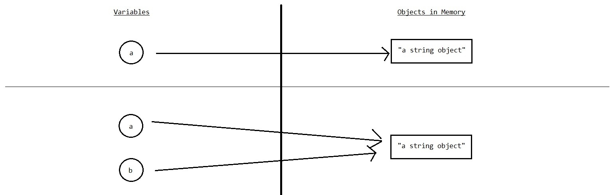
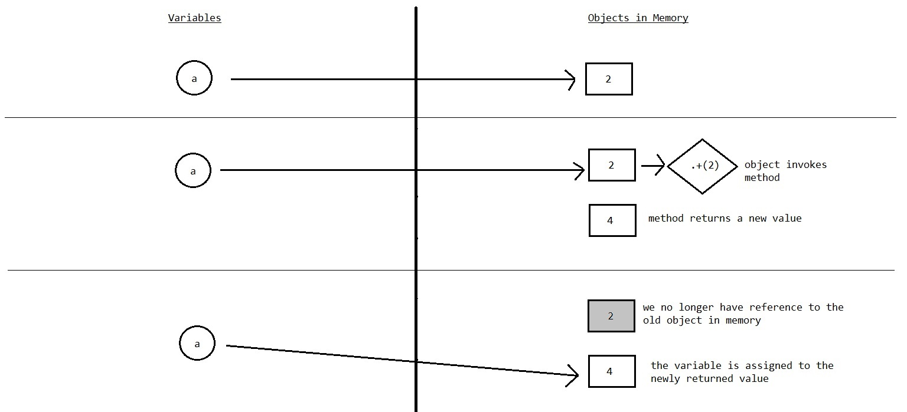

# Variables as Pointers

1. [Assignment](#assignment)
2. [Reassignment](#reassignment)
3. [Immutable Objects](#immutable-objects)

## Assignment

In Ruby, variables are basically containers that house _references_ to objects in memory. These objects are assigned to variables using an assignment statement which utilizes the assignment operator (`=`).

```ruby
a = "a string object"
```


Once assigned, variables are said to _reference_ the assigned object. The variable stores the object id of the object in question, which can be pulled up by invoking the `object_id` method.

```ruby
a = "a string object"
a.object_id             # => 260 (or some other number)
```

Two variables may reference the same object in memory, if one is assigned to the other. In this case, any change to the object made through one variable will be reflected by the other, since they both reference the same object.

```ruby
a = "a string object"
a = b
a.object_id == b.object_id    # => true
```



## Reassignment

Reassignment creates a new and different object which is then assigned to the variable. The original object referenced by the object is not affected by reassignment. This holds true for reassignment shorthand methods such as `+=`, `-+`, `*=`, etc.

```ruby
a = "a string object"
b = a
a = "another string object"
a.object_id == b.object_id    # => false
puts a                        # => "another string object"
puts b                        # => "a string object"
```

Above, local variable `a` is initialized and assigned the string object `"a string object"`. Then, local variable `b` is initialized and assigned to the object referenced by local variable `a`. Now both variables reference the same object in memory, which can be demonstrated by comparing the values returned by calling the method `object_id` on each.

Next, local variable `a` is reassigned to the string object `"another string object"`. This breaks the link between `a` and the object it originally referenced, `"a string object"`, causing it to reference the new object `"another string object"`. `b`, however, still references the original object `"a string object"`. This can be demonstrated by comparing the return values of calling `object_id` on each variable or simply outputting the values referenced by both `a` and `b`.


## Immutable Objects

Number data types (such as integers and floats) and the two Boolean objects `true` and `false` are **immutable objects** in Ruby. This means that they cannot be changed or modified. Some other types of objects that are immutable include `nil` and ranges `(1..100)`.

When arithmetic operations occur, we are not changing the number object in any way. Rather, we are reassigning the variable that references it to a new number object returned by whatever method we invoke to manipulate the original value.

```ruby
a = 2
puts a.object_id  # => 5
a = 2 + 2         # => w/o syntactical sugar a = 2.+(2) returns 4
puts a.object_id  # => 9
puts a            # => 4

# with a reassignment shortcut
a = 2
puts a.object_id  # => 5
a += 2
puts a.object_id  # => 9
puts a            # => 4
```



## Mutable Objects

**Mutable objects** are objects that _can_ be changed. They include things like Strings and collection data types like Arrays and Hashes. Mutable objects can be changed by two ways, by **setter methods** or by being passed into a [mutating method](./mutating_methods_object_passing.md#mutating-methods).

### Setter Methods

A **setter method** is one that changes _a part_ of an object, such as when elements within a collection are re-assigned.
